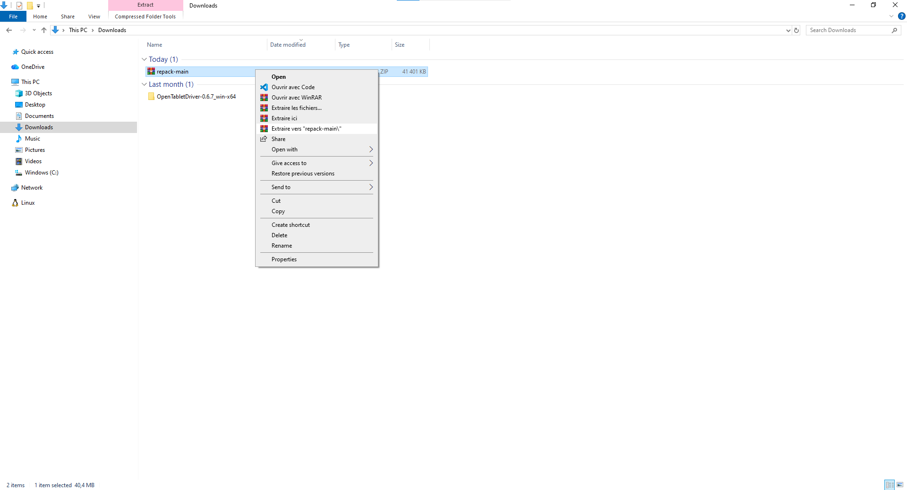
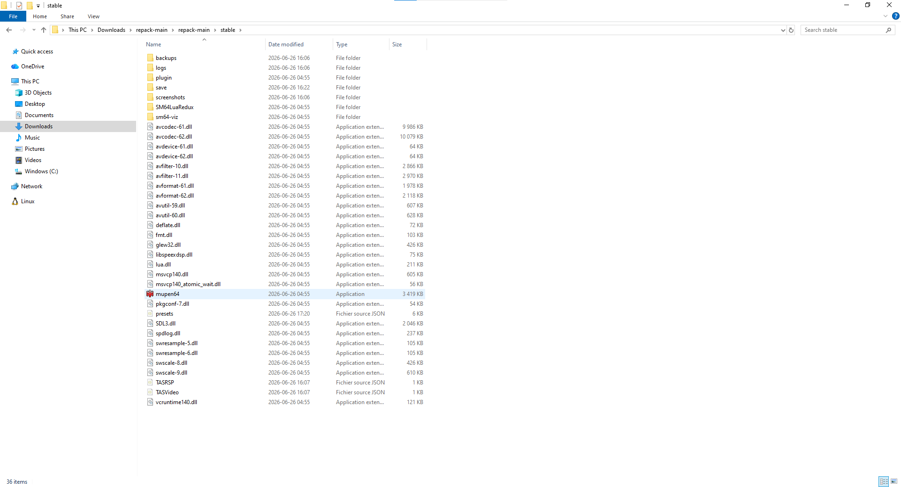
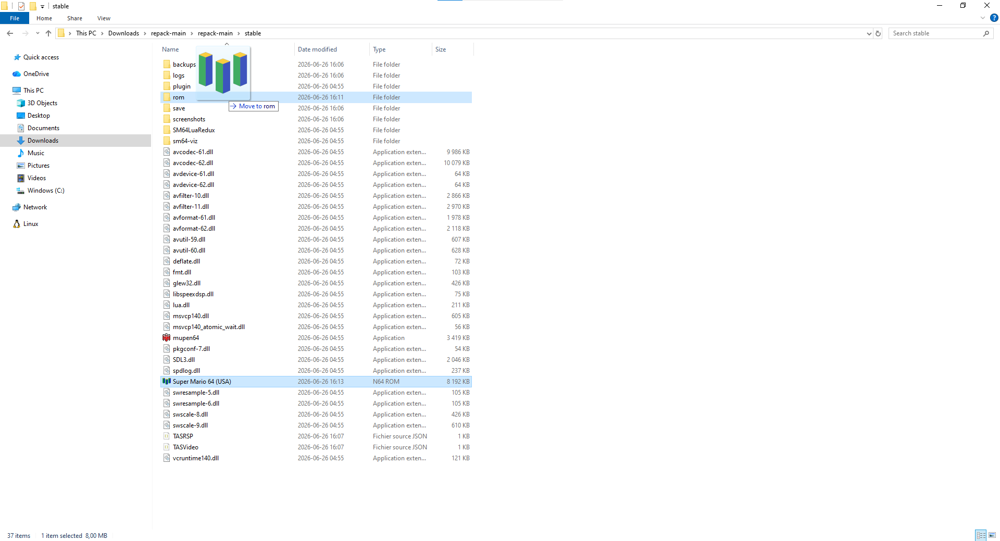
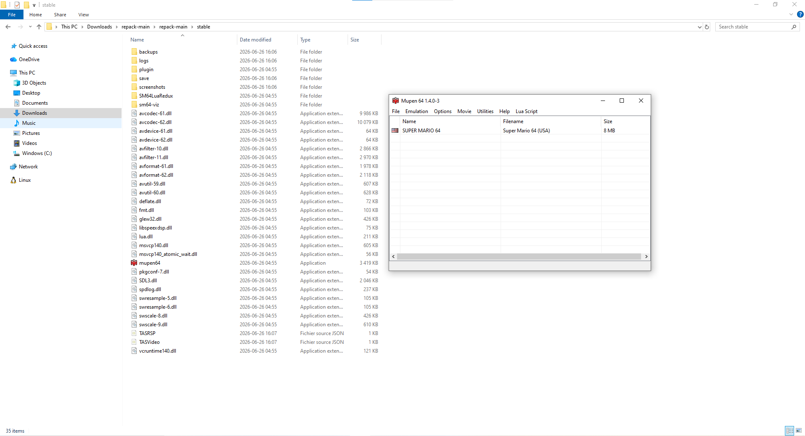
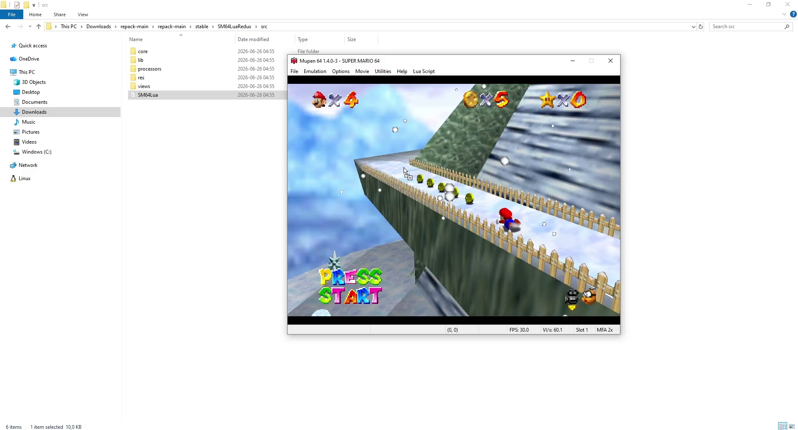
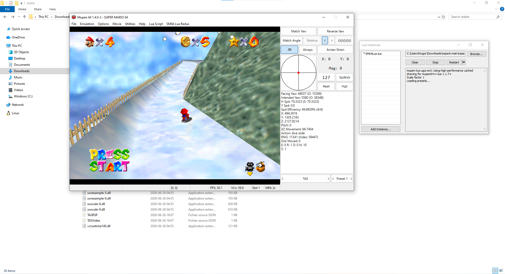

Get up and running with Mupen64 in minutes.

## 1. Extract

Extract the downloaded ZIP file (`repack-stable`) to a folder of your choice.

Open the extracted folder and navigate to `repack-main/stable`. You will see the emulator files including `mupen64.exe`.

## 2. Add ROMs

Mupen64 pulls its roms from the `rom` folder.

1. Locate the `rom` folder in your Mupen64 directory.

2. Drag your `.n64`, `.z64`, or `.v64` ROM files into the `rom` folder.

3. Mupen will list every ROM found in that folder once started. 

## 3. Launch

Double-click **mupen64.exe** to start the emulator.

When it has started, double-click a game to load it. The TAS Input window appears alongside the game.

## 4. SM64 Lua Redux (Optional)

If you're TASing Super Mario 64, you can use SM64 Lua Redux to visualize data and guide your inputs.

### 4.1 Add the Script

You can use scripts:

drag and drop `SM64Lua.lua` directly from the `SM64LuaRedux/src` folder onto the Mupen64 window.

The overlay now displays live game data on the right side of the game window.

## Common Keyboard Shortcuts

| Key | Action |
|-----|--------|
| `Ctrl + O` | Load ROM |
| `Ctrl + S` | Settings |
| `Ctrl + N` | Show Lua Instances |
| `F1` - `F10` | Save state to slot 1-10 |
| `Shift + F1` - `F10` | Load state from slot 1-10 |

You're now ready to use Mupen64's TAS capabilities.

Please note that the Mupen64 ecosystem is geared towards Super Mario 64 and its romhacks - other games might not be emulated accurately.

To learn more, join the [Mupen64 Discord Server](https://discord.gg/hFANcme32k).
